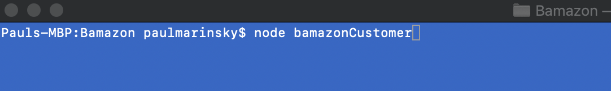

# Welcome to Bamazon!

### What is the Bamazon CLI application?
Bamazon is an interactive CLI application resembling many store-front web applications, such as Amazon, that queries a mySQL database and allows the user to make selections and return results from the database

### Getting Started
From terminal (MAC), Bash, or CLI run **$ node bamazonCustomer

