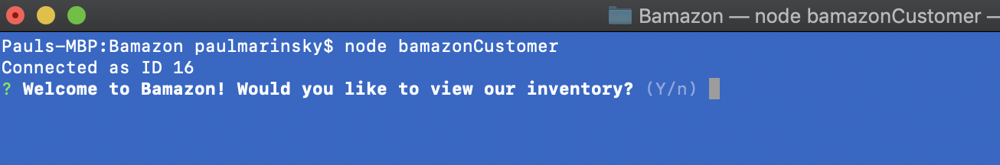
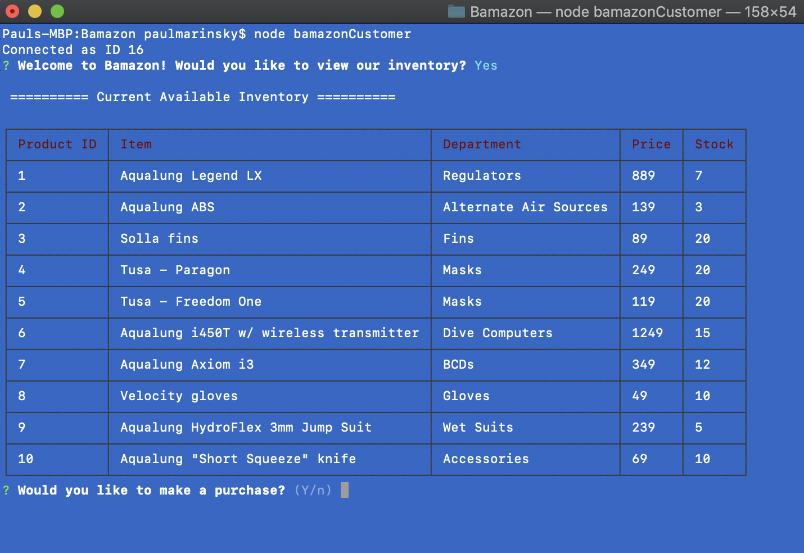
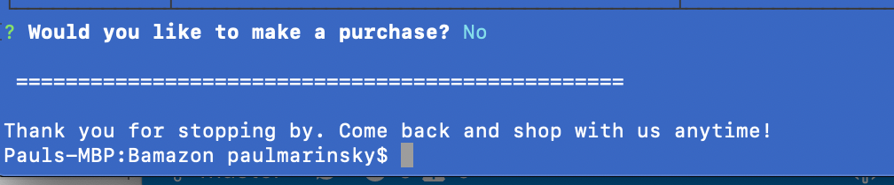
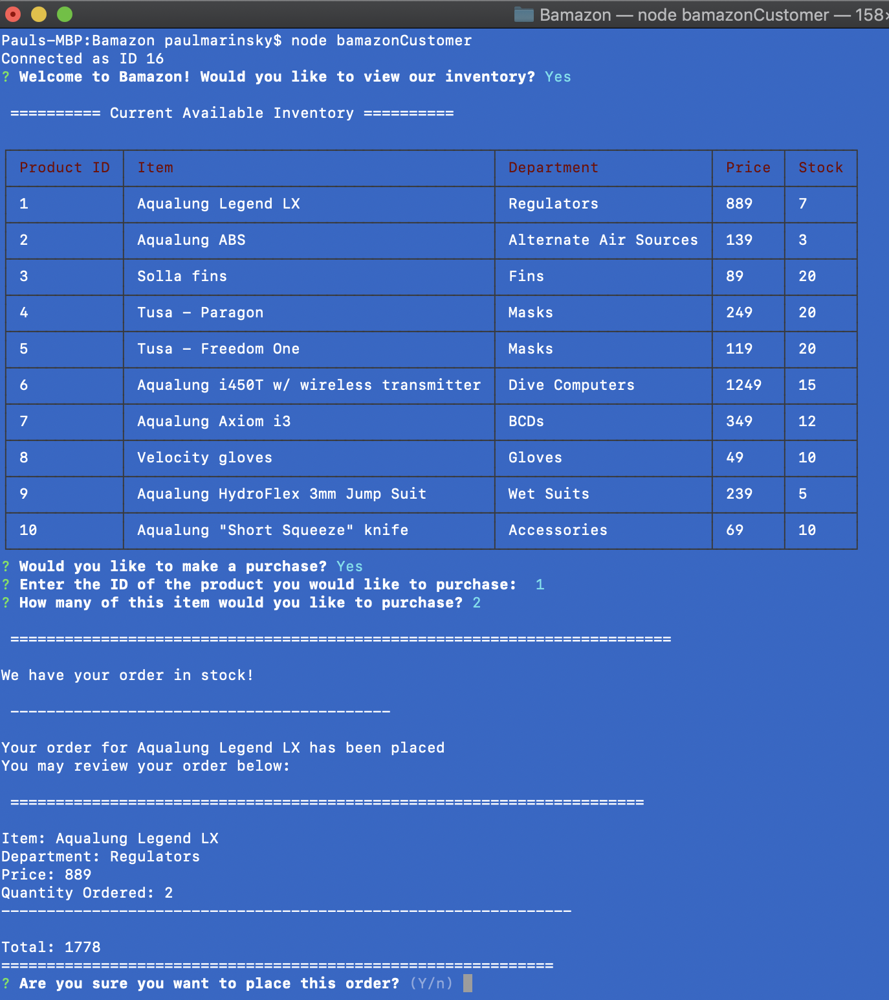
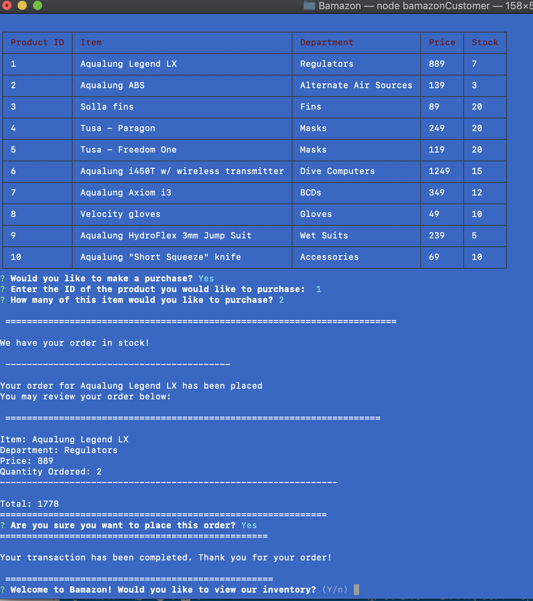
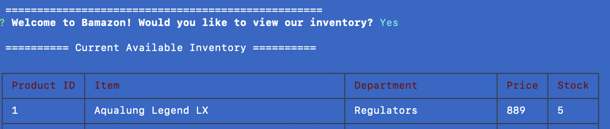

## *Welcome to Bamazon!*

### What is the Bamazon CLI application?
Bamazon is an interactive CLI application resembling many store-front web applications, such as Amazon, that queries a mySQL database and allows the user to make selections and return results from the database

### Getting Started
From terminal (MAC), Bash, or CLI run **$ node bamazonCustomer**

The CLI will then display a notification that a connection to the database has been established and a welcome message asking if the user would like to view the inventory.

#### Database Query (viewing the inventory) 
If the user inputs "Yes" the CLI application will display a tabulated listing of items in the database--in this case, merchandise.

**NOTE** *If the user were to input "NO", then the CLI will display a message and the connection to the application will terminate*

###### Building and Verifying the Order
If the user has selected to view the available inventory then the application will prompt the user to *make a purchase*, *select the item to be purchased*, and *how many of the item*. 

**AGAIN** *If the user inputs "NO", then the application will be terminated and the user will have to run **$ node bamazonCustomer** to relaunch the application

Once the order has been submitted the user will be notified whether or not the item and quantity are in stock and the application will display an invoice for the order

The user will then be prompted by the application to confirm whether or not to place the order. 
If the order is confirmed by the user then the application will notify the user that the transaction is completed and redirect the user back to the initial prompt asking if the user would like to view the inventory.

#### Updating the Database 
Anytime the user selects an item from inventory and makes a purchase, the quantity purchased will be detucted from the database.
When the viewer views the inventory again, the updated quantity will be reflected

###### TERMINATING THE APPLICATION
Recall that any time the user inputs "NO" when prompted for a "Yes" or "No" response the application will provide the user with a message and then terminate.

**Ctrl+C** will terminate the application under any circumstance

